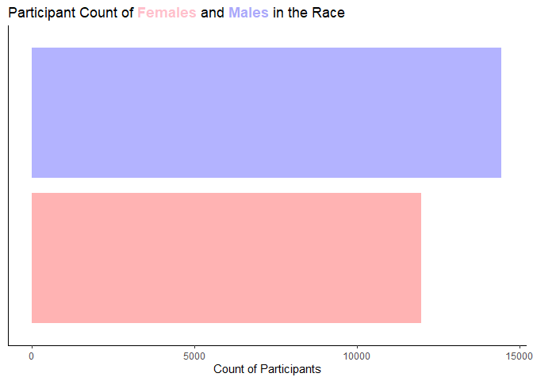
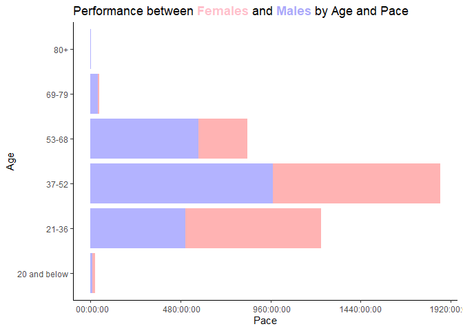
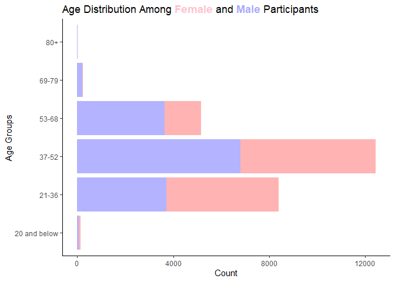

# Data Visualization Mini-Project 01 Revised

<p style='text-align: justify;'>The revised version of ['Rivera Mini Project 1'](https://rpubs.com/Krvera7522/913722), was completed to demonstrate the development of skills learned throughout the course, and to put into practice the principles of data visualization explored through different provided materials. The data frame used was “marathon_results_2017.csv”, provided by Professor Rei Sanchez. This data contained information about the finishers of the Boston marathon of 2017.</p> 

<p style='text-align: justify;'>This data set was selected among a list of 8 possible data frames. I chose this data set to analyze because I love running and I was interested to see the relationships among the variables. I was curious to see the representation among genders, age ranges of the participants, their performance, as well as to learn what were the top five countries participating.</p> 


## Loading the data.

```r
library(tidyverse)
library(dplyr)
library(ggplot2)
library(ggtext)
library(grid)

df <- read_csv("https://raw.githubusercontent.com/reisanar/datasets/master/marathon_results_2017.csv", col_types = cols())
```

## Getting Familiar with the data set


```r
# Renaming the M/F column as Sex
colnames(df)[4] <- 'Sex'
colnames(df)[19]<- 'OfficialTime'
df
```

```
## # A tibble: 26,410 x 22
##    Bib   Name    Age Sex   City  State Country `5K`   `10K` `15K` `20K` Half    
##    <chr> <chr> <dbl> <chr> <chr> <chr> <chr>   <time> <chr> <chr> <chr> <time>  
##  1 11    Kiru~    24 M     Keri~ <NA>  KEN     15'25" 0:30~ 0:45~ 1:01~ 01:04:35
##  2 17    Rupp~    30 M     Port~ OR    USA     15'24" 0:30~ 0:45~ 1:01~ 01:04:35
##  3 23    Osak~    25 M     Mach~ <NA>  JPN     15'25" 0:30~ 0:45~ 1:01~ 01:04:36
##  4 21    Biwo~    32 M     Mamm~ CA    USA     15'25" 0:30~ 0:45~ 1:01~ 01:04:45
##  5 9     Cheb~    31 M     Mara~ <NA>  KEN     15'25" 0:30~ 0:45~ 1:01~ 01:04:35
##  6 15    Abdi~    40 M     Phoe~ AZ    USA     15'25" 0:30~ 0:45~ 1:01~ 01:04:35
##  7 63    Maiy~    33 M     Colo~ CO    USA     15'25" 0:30~ 0:45~ 1:01~ 01:04:36
##  8 7     Sefi~    28 M     Addi~ <NA>  ETH     15'24" 0:30~ 0:46~ 1:02~ 01:06:04
##  9 18    Pusk~    27 M     Euge~ OR    USA     15'24" 0:30~ 0:45~ 1:01~ 01:04:53
## 10 20    Ward~    28 M     Kays~ UT    USA     15'25" 0:30~ 0:45~ 1:01~ 01:04:53
## # ... with 26,400 more rows, and 10 more variables: 25K <time>, 30K <time>,
## #   35K <time>, 40K <time>, Pace <time>, Proj Time <chr>, OfficialTime <time>,
## #   Overall <dbl>, Gender <dbl>, Division <dbl>
```


<h3>1.<span style="color:purple;">What is the proportion of males vs. females runners in the race?</span></h3>


```r
Genders <- df %>%
  group_by(Sex) %>%
  summarize(Total = n(), .groups = 'drop')

str(Genders)
```

```
## tibble [2 x 2] (S3: tbl_df/tbl/data.frame)
##  $ Sex  : chr [1:2] "F" "M"
##  $ Total: int [1:2] 11972 14438
```
Creating the first data visualization:

```r
ggplot(Genders, aes(x = Sex,y = Total, fill = Sex)) + geom_col()+ 
  theme_classic() +
    
  # Graph Aesthetics 
  labs(x = NULL,
    title = "Participant Count of <span style = 'color: pink;'>**Females**</span> and <span style = 'color: #ABA9FA;'>**Males**</span> in the Race", y = 'Count of Participants')+
  scale_fill_manual(values = alpha(c("red", "blue"), .3))+
      theme(plot.title = element_markdown(),axis.text.y=element_blank(), axis.ticks.y=element_blank())+
  theme(legend.position = 'none')+
  coord_flip()+ 
  ylim(0,14500)
```

<!-- -->

<h3 style="color:green;">__Findings__</h3>
 
 > <p style='text-align: justify;'>There is a total of 26,410 participants in the marathon, out of which 11,972 are females and 14438 are males. The marathon is comprised of 45.33% females participants and 54.66% males. One can see from the graph above that there are more males than females.</p>

<h3>2.<span style="color:purple;">What relationships can be found among Sex, Age, and Pace?</span></h3>


```r
d <- ggplot(df, aes(Pace, Age, fill = Sex))
d + geom_hex(bins = 55)+

# Graph Aesthetics
  theme_classic()+
  
labs(title = " Performance between <span style = 'color: pink;'>**Females**</span> and <span style = 'color: #ABA9FA;'>**Males**</span> by Age and Pace") +
  theme(plot.title = element_markdown())+
  theme(legend.position = 'none')+
 scale_fill_manual(values = alpha(c("red", "blue"), .3))
```

<!-- -->


```r
# Creating Age groups
 df$AGE<-df$Age
 df$AGE[df$AGE<=20]<-"20 and below"
 df$AGE[df$AGE>=21 & df$AGE<=36]<-"21-36"
 df$AGE[df$AGE>=37 & df$AGE<=52]<-"37-52"
 df$AGE[df$AGE>=53 & df$AGE<=68]<-"53-68"
 df$AGE[df$AGE>=69 & df$AGE<=79]<-"69-79"
 df$AGE[df$AGE>=80]<-"80+"
```


```r
ggplot(df, aes(x = AGE,y = Pace, fill = Sex)) + geom_col()+ 
  theme_classic() +
  labs(title = "Performance between <span style = 'color: pink;'>**Females**</span> and <span style = 'color: #ABA9FA;'>**Males**</span> by Age and Pace", y = 'Pace', x = 'Age')+
  coord_flip()+
  scale_fill_manual(values = alpha(c("red", "blue"), .3))+
  theme(plot.title = element_markdown(), legend.position = 'none')
```

<!-- -->

<h3 style="color:green;">__Findings__</h3>

> <p style='text-align: justify;'>The two graphs above illustrate that females tend to have a lower pace than males. There are still some females that are the exception and keep a quick pace, this can be seen by observing the small amount of pink dots in the first graph in the faster pace range.</p>

<h3>3.<span style="color:purple;"> What is the age distribution among the participants?</span></h3>


```r
ggplot(data = df) + 
  geom_bar(mapping = aes(x = AGE,
                         fill= Sex))+
  
labs(title = "Age Distribution Among <span style = 'color: pink;'>**Female**</span> and <span style = 'color: #ABA9FA;'>**Male**</span> Participants", y = 'Count', x = 'Age Groups')+
  scale_fill_manual(values = alpha(c("red", "blue"), .3))+
  coord_flip()+
  theme_classic()+
  theme(plot.title = element_markdown(), legend.position = 'none')
```

<!-- -->

<h3 style="color:green;">__Findings__</h3>

> <p style='text-align: justify;'>The majority of participants seem to be in the age ranges of 20-35 and 36-51. It is interesting to note that there are many more females in the age range 20-35 than males and more males than females in the age range 36-51.</p>

<h3>4.<span style="color:purple;">What are the top ten countries present in the marathon?</span></h3>

```r
df %>% count(Country) %>% arrange(-n) %>% head(5) %>%
 ggplot(aes(reorder(Country,n),n)) + geom_col(fill= '#ABA9FA') + coord_flip() +
  
  labs(title = 'Top 5 Countries Present in the Race', y = 'Amount of Participants', x = 'Countries')+
  theme_classic()
```

<!-- -->

<h3 style="color:green;">__Findings__</h3>

> <p style='text-align: justify;'>The top five countries participating in the marathon are seen illustrated in the graph above. These countries are: USA, CAN, GBR, MEX, and CHN. It is evident that most participants come from the United States, this is also a reasonable conclusion as the marathon was held in the city of Boston of United States.</p>


<h3 style="color:black;">__Conclusion__</h3>

<p style='text-align: justify;'>After analyzing the data one can see that the majority of participants in the Boston Marathon in 2017 were males, with a percentage of 54.66% and females made up the rest 45.33%. The age ranges most present in the race were the age range from 20 to 35 and 52 through 67. Most participants came from the USA and this conclusion is reasonable as the marathon was held in the city of Boston. Even though the majority of the participants were from the USA, there was a representation of other countries such as: Canada, Great Britain, Mexico, China, and many others. It was also very interesting to note the trend between the sexes, the data illustrated that males tend to have a quicker pace than females. Though there are the exception of some females is more common to see the before mentioned trend.</p>

<p style='text-align: justify;'>The application of the principles in data visualization and design helped me discover the relationships among the different variables and uncover the story waiting to be told by the data. I was able to accomplished this by using ggplot2 to graph scatter plots and bar plots. Utilizing the aesthetics of the graphs helped me direct the audience attention to the desired sections. The cleaning and grouping of the data aided in the preparation before the graphs. All this process contributed to unfolding the beautiful story described below.</p>

<p style='text-align: justify;'>This data set told an interesting and heartfelt story about the participants that finished the Boston Marathon in 2017. It is inspiring to see that no matter the different paces, origins, genders, and obstacles, among participants, they all aimed to complete one mission and that was to finish this 40K marathon. It's nice to see people coming together from different ways of living for a shared and cherished activity. Just like the famous story "The Tortoise and the Hare" , Males with quick paces and females with much lower paces were able to finish the race. People from all age groups took up the challenge and conquered. Different countries raced to the finish line, but all with one shared goal, to finish the 40k marathon.</p>
