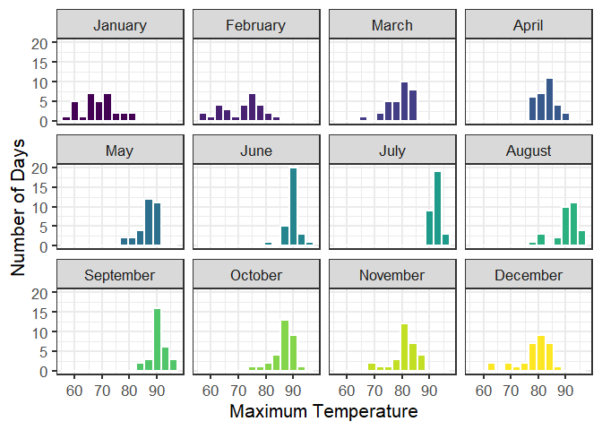
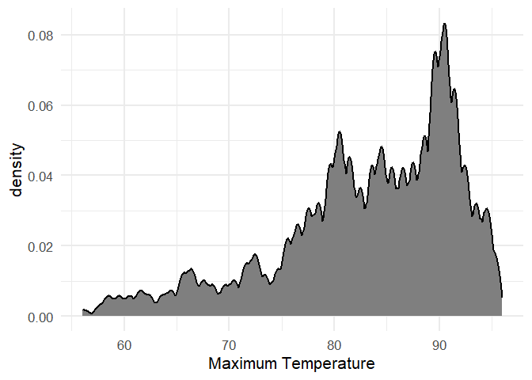
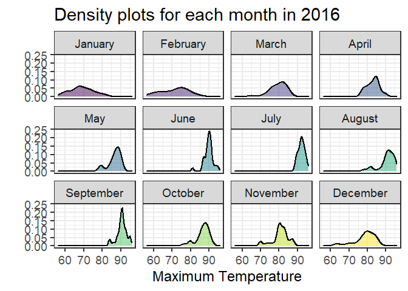
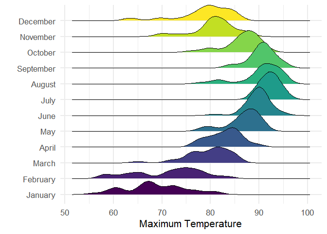
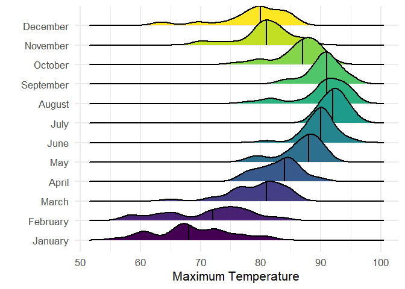
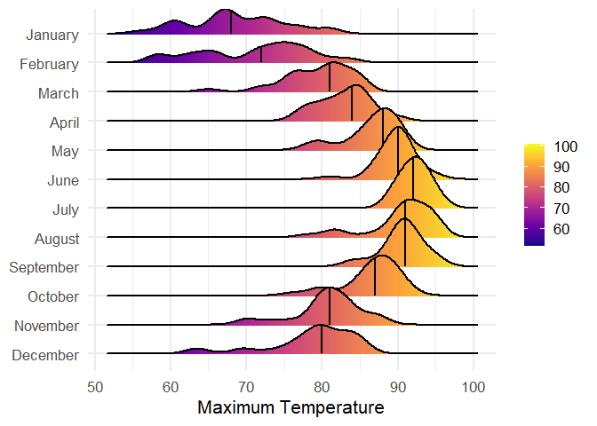

# Data Visualization Project 03


In this exercise you will explore methods to visualize text data and practice how to recreate charts that show the distributions of a continuous variable. 


## Part 1: Density Plots

Using the dataset obtained from FSU's [Florida Climate Center](https://climatecenter.fsu.edu/climate-data-access-tools/downloadable-data), for a station at Tampa International Airport (TPA) from 2016 to 2017, attempt to recreate the charts shown below


```r
library(tidyverse)
weather_tpa <- read_csv("https://github.com/reisanar/datasets/raw/master/tpa_weather_16_17.csv")
# random sample 
sample_n(weather_tpa, 4)
```

```
## # A tibble: 4 x 6
##    year month   day precipitation max_temp min_temp
##   <dbl> <dbl> <dbl>         <dbl>    <dbl>    <dbl>
## 1  2016     6     5          0.77       89       76
## 2  2016     4    30          0          89       74
## 3  2016     9    11          0          95       78
## 4  2016     4     6          0          82       64
```


See https://www.reisanar.com/slides/relationships-models#10 for a reminder on how to use this dataset with the `lubridate` package for dates and times.


(a) Recreate the plot below:


```r
# Creating Month groups
 weather_tpa$month<-weather_tpa$month
 weather_tpa$month[weather_tpa$month==1]<-"January"
 weather_tpa$month[weather_tpa$month==2]<-"February"
 weather_tpa$month[weather_tpa$month==3]<-"March"
 weather_tpa$month[weather_tpa$month==4]<-"April"
 weather_tpa$month[weather_tpa$month==5]<-"May"
 weather_tpa$month[weather_tpa$month==6]<-"June"
 weather_tpa$month[weather_tpa$month==7]<-"July"
 weather_tpa$month[weather_tpa$month==8]<-"August"
 weather_tpa$month[weather_tpa$month==9]<-"September"
 weather_tpa$month[weather_tpa$month==10]<-"October"
 weather_tpa$month[weather_tpa$month==11]<-"November"
 weather_tpa$month[weather_tpa$month==12]<-"December"

  weather_tpa$month <-factor(weather_tpa$month,      # Reordering group factor levels
                         levels = c("January", "February", "March", "April", "May", "June", "July", "August", "September","October","November","December"))
```


```r
 ggplot(weather_tpa, aes(x = max_temp, fill=month)) +
  geom_histogram(colour = "white", size = .8, binwidth = 3,show.legend=FALSE) +
  scale_y_continuous( name = "Number of Days" ) +
  scale_x_continuous( name = "Maximum Temperature" ) +
  facet_wrap(~ month)+
  theme_bw(16)+
  scale_fill_viridis_d()
```




Hint: the option `binwidth = 3` was used with the `geom_histogram()` function.

(b) Recreate the plot below:


Hint: check the `kernel` parameter of the `geom_density()` function, and use `bw = 0.5`.


```r
ggplot(weather_tpa)+
  geom_density(mapping = aes(x = max_temp), bw = .5, kernel = 'epanechnikov', size = 1, fill = '#7f7f7f')+
  theme_minimal(16)+
  labs(y = 'density', x = 'Maximum Temperature')
```

<!-- -->


(c) Recreate the chart below:


Hint: default options for `geom_density()` were used. 


```r
ggplot(weather_tpa, aes(x = max_temp, fill=month)) +
  geom_density(alpha = 0.5, show.legend=FALSE, size = 1) +
  facet_wrap(~ month)+
  theme_bw(18)+
  scale_fill_viridis_d()+
  labs(title='Density plots for each month in 2016', x = 'Maximum Temperature', y = '')
```

<!-- -->


(d) Recreate the chart below:


Hint: default options for `geom_density()` were used. 


```r
library(ggridges)
```

```
## Warning: package 'ggridges' was built under R version 4.1.3
```

```r
ggplot(weather_tpa, aes(x = max_temp, y = fct_rev(month), fill = month)) +
  geom_density_ridges() +
  guides(fill = 'none')+
  scale_fill_viridis_d()+
  theme_minimal(16)+
  labs(x = 'Maximum Temperature', y = '')+
  scale_y_discrete(limits=rev)
```

```
## Picking joint bandwidth of 1.49
```

<!-- -->


(e) Recreate the plot below:


Hint: use the`ggridges` package, and the `geom_density_ridges()` function paying close attention to the `quantile_lines` and `quantiles` parameters.


```r
library(ggridges)
ggplot(weather_tpa, aes(x = max_temp, y = fct_rev(month), fill = month)) +
geom_density_ridges(quantile_lines = TRUE, quantiles = 2, size = 1, bandwidth=1.49) +
guides(fill = 'none')+
  scale_fill_viridis_d()+
  theme_minimal(16)+
  labs(x = 'Maximum Temperature', y = '')+
  scale_y_discrete(limits=rev)
```

<!-- -->


(f) Recreate the chart below:


Hint: this uses the `plasma` option (color scale) for the _viridis_ palette.


```r
library(ggridges)


ggplot(weather_tpa, aes(x = max_temp, y = fct_rev(month), fill = ..x..)) +
geom_density_ridges_gradient(quantile_lines = TRUE, quantiles = 2, size = 1, bandwidth=1.49) +
scale_fill_viridis_c(option='plasma')+
theme_minimal(16)+
labs(x = 'Maximum Temperature', y = NULL)+
  theme(legend.title = element_blank())
```

<!-- -->


## Part 2: Visualizing Text Data

Review the set of slides (and additional resources linked in it) for visualizing text data: https://www.reisanar.com/slides/text-viz#1

Choose any dataset with text data, and create at least one visualization with it. For example, you can create a frequency count of most used bigrams, a sentiment analysis of the text data, a network visualization of terms commonly used together, and/or a visualization of a topic modeling approach to the problem of identifying words/documents associated to different topics in the text data you decide to use. 

Make sure to include a copy of the dataset in the `data/` folder, and reference your sources if different from the ones listed below:

- [Billboard Top 100 Lyrics](https://github.com/reisanar/datasets/blob/master/BB_top100_2015.csv)

- [RateMyProfessors comments](https://github.com/reisanar/datasets/blob/master/rmp_wit_comments.csv)

- [FL Poly News 2020](https://github.com/reisanar/datasets/blob/master/poly_news_FL20.csv)

- [FL Poly News 2019](https://github.com/reisanar/datasets/blob/master/poly_news_FL19.csv)

(to get the "raw" data from any of the links listed above, simply click on the `raw` button of the GitHub page and copy the URL to be able to read it in your computer using the `read_csv()` function)
